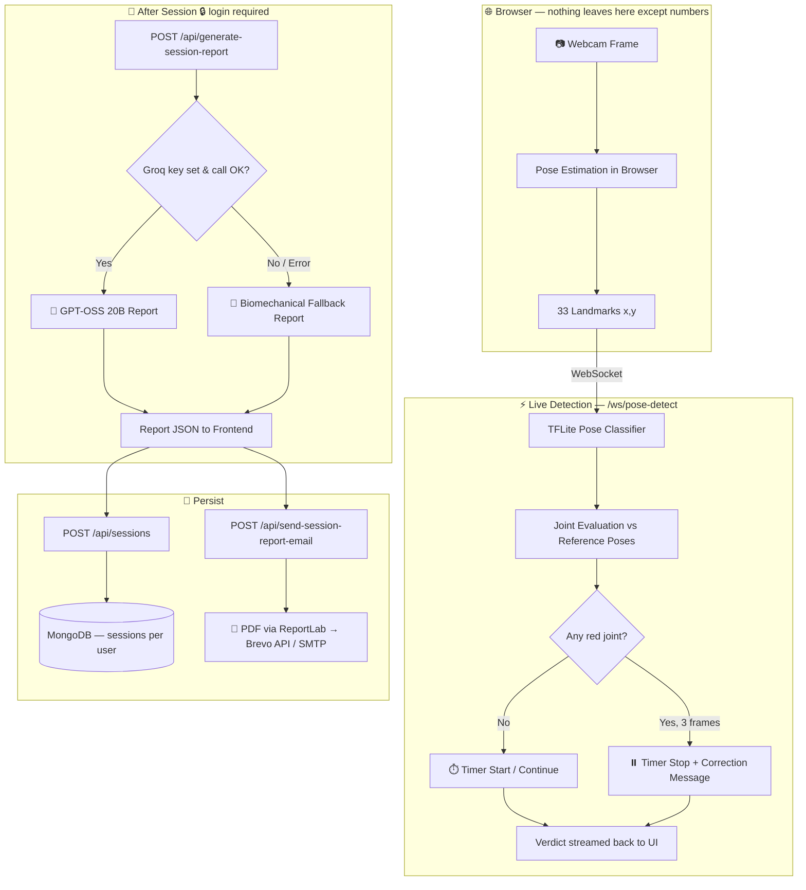

<div align="center">


# 🧘 ASANA-SENSE Backend

### *AI-Powered Computer Vision Yoga Guide — See • Guide • Improve*


**Real-time yoga posture correction that never records your camera — only skeletal landmarks travel to the server.**

[✨ Features](#-key-features) • [🧠 How It Works](#-how-the-pipeline-works) • [🛣️ API Routes](#️-api-routes) • [🔐 Security](#-security--privacy-commitments) • [📊 Live Ops](#-live-ops-dashboard) • [🚀 Quick Start](#-getting-started) • [🐳 Docker](#-docker--deployment)

</div>

---

## 📌 Executive Summary

**ASANA-SENSE** turns any webcam into a personal yoga teacher. This repository is the **FastAPI backend** powering it:

1. **Real-Time Pose Detection**: The browser extracts 33 body landmarks and streams them over WebSocket. The server classifies the pose with a **TFLite model** and answers frame-by-frame with correctness, joint feedback and a hold-timer signal.
2. **Joint-Level Correction**: Every key joint is judged **green / yellow / red** against reference pose statistics, with plain-language correction messages (e.g. *"You're doing Warrior. Switch to Tree."*).
3. **AI Session Reports**: When a session ends, **Groq (`openai/gpt-oss-20b`)** writes a friendly, human-readable report — with an automatic **biomechanical fallback** if the AI is unavailable.
4. **Verified Accounts**: Email signup is confirmed with a **6-digit OTP**; **Google** and **Microsoft** sign-in are also supported; password reset is built in.
5. **Progress Tracking**: Sessions and reports are stored per user in MongoDB, powering history and improvement stats.
6. **Certified PDF Emails**: One request builds a PDF report with ReportLab and mails it to the user (Brevo HTTPS API, or SMTP as fallback).
7. **Privacy by Design**: No video, no audio, no images reach the backend. Profile fields are **AES-256-GCM encrypted at rest**.

---

## ✨ Key Features

### 🎯 1. Live Pose Engine
- **WebSocket pipeline** at `/ws/pose-detect` — landmarks in, verdict out, every frame.
- **TFLite classifier** identifies which of the supported poses the user is holding (or `no_pose`), with a confidence score. Confidence below **0.6** is treated as "no pose detected".
- **Target-pose aware**: compares what you're doing against what you *should* be doing. A wrong pose is flagged after **3 consecutive frames**.
- **Smart hold timer**: starts/continues while form is correct; yellow joints never stop it; red joints must persist for **3 frames** before a running timer stops.
- **Pluggable runtime**: uses `ai-edge-litert` first, then `tflite_runtime`, then full TensorFlow — all run the same `.tflite` model.
- **Thread-safe & hardened**: inference is serialized with a lock and runs off the event loop; malformed, oversized (>20 KB) or non-finite landmark messages are rejected.

### 🧘 2. Supported Poses
| Pose | Pose | Pose |
|---|---|---|
| 🪑 Chair Pose | 🐍 Cobra Pose | 🐕 Downward-Facing Dog |
| 🕯️ Shoulder Stand | 🔺 Triangle Pose | 🌳 Tree Pose |
| 🦅 Warrior III | | |

The model has 8 classes: the 7 poses above plus `no_pose`.

### 🤖 3. AI Report Generation
- **Groq `openai/gpt-oss-20b`** synthesizes accuracy, hold time and the previous session into an encouraging report: scores, strengths, growth areas, per-pose tips, joint-safety cues and nutrition guidance.
- **Graceful fallback**: no key / failed call / timeout → the backend switches to a built-in biomechanical analysis engine. The report *always* arrives.
- Reports are tagged with `aiProvider` (`openai/gpt-oss-20b` or `Veda AI Biomechanics Engine`) so you always know who wrote them.
- **Login required** and **rate-limited** to 6 report requests per minute per user.

### 📧 4. Email & PDF Delivery
- ReportLab-built PDF, emailed straight to the signed-in user's registered address.
- Also sends: signup OTP codes, welcome emails and password-reset links.
- **Brevo HTTPS API** is used when `BREVO_API_KEY` is set (recommended on hosts that block SMTP ports, such as Render); otherwise it falls back to **SMTP**.
- Blocking PDF + email work runs in a thread pool so the event loop never stalls.

### 👤 5. Accounts & Onboarding
- **OTP-verified signup**: `send-otp` → `verify-otp` (code valid 10 min, max 5 wrong attempts, 30 s resend cooldown).
- **Sign in** with email + password (same error message and similar response time for unknown email vs. wrong password), plus **Google** and **Microsoft** sign-in via ID-token verification.
- **Forgot / reset password** with single-use, 15-minute reset links.
- Onboarding data: age category, experience level, BMI data.
- Session history + aggregated stats per user.
- **Account deletion** removes the user and all their sessions.

### 📊 6. Live Ops Dashboard *(optional, key-protected)*
- Light-mode ticket-style feed of every API call, categorized live: **Auth • Pose-Detect • AI Report • Session • System**.
- Great for demos — watch requests land in real time.

---

## 🧠 How the Pipeline Works



> 💡 **Two separate pipelines:** the live ML loop (WebSocket, per-frame, no AI API) and the end-of-session report (REST, Groq once per session).

### 📡 WebSocket message format

**Client → server**
```json
{ "type": "landmarks", "target_pose": "tree", "landmarks": [[x, y], "... 33 pairs"] }
```

**Server → client** (`type: "pose_result"`)

| Field | Meaning |
|---|---|
| `predicted_pose`, `confidence`, `target_pose` | What the model sees vs. what the user should be doing |
| `is_correct` | All joints green **and** pose matches |
| `has_red` / `has_yellow` | At least one critical / warning joint |
| `joints` | `[{index, name, status: correct\|warning\|critical, deviation}]` |
| `pose_mismatch` | User confirmed doing a different pose (joints empty) |
| `pose_detected` | `false` for `no_pose` / low confidence (joints empty) |
| `reference_available` | `false` ⇒ no reference data for this pose, joints are **not** really scored |
| `timer_action` | `start` \| `continue` \| `stop` \| `idle` |
| `correction_message` | Human-readable cue |

Errors arrive as `{ "type": "error", "code": "too_large" \| "bad_json" \| "model_not_loaded" \| "processing_error", "message": ... }`.

**Joint thresholds** (deviation in standard deviations from the reference): `< 2.0` green · `2.0–3.5` yellow · `≥ 3.5` red.

---

## 🛣️ API Routes

| Method | Endpoint | Auth | Purpose |
|:---:|---|:---:|---|
| 🟢 `GET` | `/` | — | Backend homepage / service information |
| 🟢 `GET` | `/api/health` | — | Service health check |
| 🟡 `POST` | `/api/auth/send-otp` | — | Start signup: validate and email a 6-digit code |
| 🟡 `POST` | `/api/auth/verify-otp` | — | Confirm code → create account → JWT |
| 🟡 `POST` | `/api/auth/resend-otp` | — | New code for a pending signup |
| 🟡 `POST` | `/api/auth/signin` | — | Email + password login → JWT |
| 🟡 `POST` | `/api/auth/oauth-google` | — | Sign in / sign up with a Google ID token |
| 🟡 `POST` | `/api/auth/oauth-microsoft` | — | Sign in / sign up with a Microsoft ID token |
| 🟡 `POST` | `/api/auth/forgot-password` | — | Email a single-use reset link |
| 🟡 `POST` | `/api/auth/reset-password` | — | Set a new password with the reset token |
| 🟡 `POST` | `/api/auth/send-welcome-email` | 🔒 | Re-send the welcome email |
| 🟢 `GET` | `/api/auth/me` | 🔒 | Current user profile |
| 🟠 `PATCH` | `/api/auth/profile` | 🔒 | Update onboarding / BMI / experience |
| 🔴 `DELETE` | `/api/auth/account` | 🔒 | Permanently delete account and its sessions |
| 🟢 `GET` | `/api/auth/oauth-debug` | — | Debug: shows whether OAuth client IDs are configured *(disable/remove in production)* |
| 🟢 `GET` | `/api/poses` | — | List all yoga poses |
| 🟢 `GET` | `/api/poses/{pose_id}` | — | Single pose detail |
| 🟡 `POST` | `/api/sessions` | 🔒 | Save completed session + AI report (updates user stats) |
| 🟢 `GET` | `/api/sessions` | 🔒 | User's latest 30 sessions |
| 🟢 `GET` | `/api/sessions/{session_id}` | 🔒 | One session in detail |
| 🟡 `POST` | `/api/generate-session-report` | 🔒 | Generate AI / fallback report *(6 req/min/user)* |
| 🟡 `POST` | `/api/send-session-report-email` | 🔒 | Email the PDF report |
| 🔌 `WS` | `/ws/pose-detect` | — | Real-time pose classification |
| 🟢 `GET` | `/ops?key=…` | 🔑 | Live ops dashboard *(needs `OPS_KEY`)* |
| 🔌 `WS` | `/ws/live?key=…` | 🔑 | Dashboard event feed *(needs `OPS_KEY`)* |

🔒 = `Authorization: Bearer <JWT>` · 🔑 = `OPS_KEY` query parameter

> Interactive Swagger docs auto-generated at **`/docs`**.

---

## 🎨 Brand Palette

Straight from the ASANA-SENSE logo:

| Color | Hex | Usage |
|---|---|---|
| 🔵 **Deep Navy** | `#123B66` | Headings, brand wordmark |
| 🌐 **Vision Blue** | `#2E7FE0` | Landmarks, links, auth events |
| 🌿 **Balance Green** | `#1FAE7A` | Correct form, live status, success |
| 🟡 **Amber** | `#C98A0A` | AI report events, highlights |
| 🔴 **Alert Red** | `#E5484D` | Wrong joint, errors |
| ⚪ **Mint Canvas** | `#F6FAF8` | Dashboard background |

---

## 🛠️ Project Structure

```
backend/
├── main.py                  # App entry, CORS, activity middleware, lifespan (DB, model, references)
├── auth.py                  # JWT + get_current_user dependency
├── crypto_utils.py          # 🔐 AES-256-GCM field encryption
├── database.py              # MongoDB (Motor) connection & collections
├── models.py                # Pydantic request/response schemas
├── pose_engine.py           # 🧠 TFLite classifier + joint evaluation
├── reference_poses.py       # Reference pose statistics (from training CSV, cached in MongoDB)
├── email_service.py         # 📄 ReportLab PDF + Brevo API / SMTP sender
├── cloudinary_utils.py      # Cloudinary config + pose image URLs
├── seed_data.py             # Seeds the yoga pose catalogue + reference poses
├── live_feed.py             # 📊 In-memory feed for ops dashboard
├── dashboard.html           # 📊 Live ops dashboard page
├── load_test.py             # Simulates N users streaming to /ws/pose-detect
├── report.txt               # Runtime / dependency / model notes
├── Dockerfile               # 🐳 Production image (Render-ready)
├── .dockerignore
├── requirements.txt
├── .env.example
├── ml/
│   └── models/
│       └── yoga_pose_classifier.tflite
└── routes/
    ├── __init__.py          # register_routes(app)
    ├── auth.py              # /api/auth/* (OTP signup, signin, reset, profile, delete)
    ├── oauth.py             # /api/auth/oauth-* (Google + Microsoft)
    ├── poses.py             # /api/poses/*
    ├── sessions.py          # /api/sessions/*
    ├── reports.py           # AI report + email
    ├── websocket.py         # /ws/pose-detect
    └── live_ops.py          # /ops + /ws/live
```

---

## 🔐 Security & Privacy Commitments

> [!IMPORTANT]
> - **No raw media, ever**: The only camera-derived data reaching the server is an array of 33 numeric `(x, y)` landmarks. No frames, no images, no audio.
> - **Nothing persisted from live detection**: WebSocket frames are processed and discarded. Only final session summaries are saved.
> - **AES-256-GCM at rest**: `name` and `bmi_data` are encrypted before hitting MongoDB, with a fresh random nonce per write and tamper detection built in.
> - **bcrypt passwords**: One-way hashed, never reversible. Hashing runs off the event loop.
> - **JWT auth**: Protected routes require a valid signed token. `JWT_SECRET` must be **at least 32 characters** or the server refuses to start.
> - **Email-verified accounts**: Signup requires an OTP; OTPs are limited to 5 attempts and a 30 s resend cooldown.
> - **Strict OAuth verification**: Google/Microsoft ID tokens are verified (RS256 signature, audience, issuer, expiry). Google requires a verified email; Microsoft work/school accounts require a domain-verified email.
> - **Limited user enumeration protection**: Sign-in and forgot-password give the same response whether or not the email exists. Signup (`send-otp`) does reveal that an email is already registered (HTTP 409), and `forgot-password` returns 503 if the reset email fails to send.
> - **Server-side AI key only**: The Groq key is never taken from the client.
> - **Ops dashboard fails closed**: If `OPS_KEY` is unset, `/ops` and `/ws/live` are disabled.

> [!NOTE]
> `email` stays plaintext so login lookup and the unique index keep working. The AES key lives only in the server `.env` — **back it up and never commit it**; losing it makes encrypted fields unreadable.

> [!WARNING]
> - **OTP codes and password-reset tokens are stored in process memory.** They reset on restart and are not shared between workers — run a **single process**, or move them to Redis before scaling out.
> - `/ws/pose-detect` is intentionally unauthenticated (it receives only anonymous landmarks).
> - CORS is currently configured permissively in `main.py`; tighten `allow_origins` for production.

---

## 📊 Live Ops Dashboard

A light-mode, ticket-style feed for demos and debugging.

1. Keep `live_feed.py` and `dashboard.html` in the backend root.
2. `routes/live_ops.py` is registered in `routes/__init__.py`.
3. Keep the `record_activity` middleware in `main.py`.
4. Set **`OPS_KEY`** in `.env`, then open **`http://localhost:8000/ops?key=<OPS_KEY>`** 🚀

Filters: **ALL • AUTH • POSE-DETECT • AI REPORT • SESSION • SYSTEM**

---

## 🚀 Getting Started

### Prerequisites
- 🐍 **Python** 3.12 (used by the Docker image and the project's tested environment)
- 🍃 **MongoDB Atlas** cluster
- ☁️ **Cloudinary** account
- 📧 **Email sender** — a **Brevo** API key *(recommended)* **or** a Gmail App Password (SMTP). Needed for OTP, reset and report emails.
- 🤖 **Groq** API key *(optional — fallback works without it)*
- 🔑 **Google / Microsoft client IDs** *(optional — only for social sign-in)*

### 1️⃣ Install

```bash
cd backend
python -m venv venv

# Windows
.\venv\Scripts\activate
# macOS / Linux
source venv/bin/activate

pip install -r requirements.txt
```

### 2️⃣ Configure `.env`

Copy `.env.example` → `.env` and fill in:

```env
# Database
MONGODB_URI=mongodb+srv://<user>:<pass>@<cluster>.mongodb.net/asana_sense
# MONGODB_DB_NAME=asana_sense          # optional override (default asana_sense)

# Auth  (JWT_SECRET must be >= 32 chars)
JWT_SECRET=your-super-secret-jwt-key-at-least-32-characters
JWT_EXPIRY_MINUTES=1440

# Cloudinary
CLOUDINARY_CLOUD_NAME=your-cloud-name
CLOUDINARY_API_KEY=your-api-key
CLOUDINARY_API_SECRET=your-api-secret

# ML model
# (the model ships at ml/models/ inside this repo; the engine also auto-checks ../ml/models/ and ml/models/)
TFLITE_MODEL_PATH=ml/models/yoga_pose_classifier.tflite

# CORS / links (first origin is used for password-reset links)
FRONTEND_ORIGIN=http://localhost:3000

# AI reports (Groq)
GROQ_API_KEY=gsk_your_key

# 🔐 AES-256 profile encryption key
PROFILE_ENCRYPTION_KEY=your-32-byte-urlsafe-base64-key

# 📊 Ops dashboard key (unset = dashboard disabled)
OPS_KEY=change-me-long-random-string

# 🔑 Social sign-in (optional)
GOOGLE_CLIENT_ID=your-google-web-client-id
MICROSOFT_CLIENT_ID=your-azure-app-client-id

# 📧 Email — option A (recommended, works on Render): Brevo HTTPS API
BREVO_API_KEY=your-brevo-api-key
SMTP_FROM_EMAIL=your-verified-brevo-sender@example.com
SMTP_FROM_NAME=ASANA - SENSE AI

# 📧 Email — option B (fallback): SMTP
SMTP_HOST=smtp.gmail.com
SMTP_PORT=587
SMTP_USER=your-email@gmail.com
SMTP_PASSWORD=your-16-char-app-password

# Set to 1 once to force recompute of pose reference statistics
# REFRESH_REFERENCES=1
```

Generate the encryption key:

```bash
python -c "import os,base64;print(base64.urlsafe_b64encode(os.urandom(32)).decode())"
```

Generate a JWT secret:

```bash
python -c "import secrets; print(secrets.token_urlsafe(48))"
```

> ⚠️ If you use SMTP with Gmail, `SMTP_PASSWORD` must be a **Gmail App Password** (Google Account → Security → 2-Step Verification → App passwords), not your normal password. If `BREVO_API_KEY` is set, Brevo is used and SMTP is ignored.

### 3️⃣ Seed the database (first run)

```bash
python seed_data.py
```

This loads the pose catalogue into MongoDB and computes the **reference pose statistics** used for joint scoring. The statistics are built from the training CSV (`train_landmarks.csv`, looked up in `../`, `../ml/data/`, `ml/data/` and the backend root) and then cached in MongoDB. If the CSV and cache are both missing, the server still runs, but joints are **not scored** (`reference_available: false`).

### 4️⃣ Run

```bash
python main.py
# or
uvicorn main:app --host 0.0.0.0 --port 8000 --reload
```

- 🌐 API: **http://localhost:8000**
- 📖 Swagger docs: **http://localhost:8000/docs**
- 📊 Ops dashboard: **http://localhost:8000/ops?key=<OPS_KEY>**

### 🧪 Load test

With the server running, simulate many users streaming landmarks at once:

```bash
python load_test.py              # 10 users, 15 s, 10 fps each
python load_test.py 25 20 10     # 25 users, 20 s, 10 fps each
```

It reports frames answered, failed users and p50 / p95 / max latency.

---

## 🐳 Docker & Deployment

```bash
docker build -t asana-sense-backend .
docker run --env-file .env -p 10000:10000 asana-sense-backend
```

- Base image: `python:3.12-slim`.
- Listens on **`$PORT`** (defaults to **10000**), which matches Render's convention.
- `TFLITE_MODEL_PATH` is preset to `/app/ml/models/yoga_pose_classifier.tflite`; the model ships inside the image.
- `.env` is excluded from the image — provide variables through your host's environment settings.
- Run a **single worker** (OTP and reset tokens live in memory).

---

## 🩺 Troubleshooting

| Symptom | Cause | Fix |
|---|---|---|
| 🔴 Server won't start, mentions `JWT_SECRET` | Missing or shorter than 32 characters | Generate a longer secret |
| 🔴 Server won't start, mentions `PROFILE_ENCRYPTION_KEY` | Key missing or not 32 bytes | Generate and add the key |
| 🔴 Server won't start, can't reach MongoDB | Bad `MONGODB_URI` or Atlas IP not allowed | Check URI and Atlas network access |
| 🟡 Report looks generic | Groq failed → fallback engine used | Check `GROQ_API_KEY` and server logs |
| 🔴 Groq returns **401** | Invalid / expired / mistyped API key | Create a fresh key, no spaces or quotes |
| 🔴 OTP / welcome / report email fails | No email provider configured, or SMTP password isn't an App Password | Set `BREVO_API_KEY`, or `SMTP_USER` + `SMTP_PASSWORD` |
| 🔴 Email works locally but not on Render | Host blocks SMTP ports | Use `BREVO_API_KEY` (HTTPS) |
| 🟡 "Please wait 30 seconds…" on signup | OTP resend cooldown | Wait, then retry |
| 🟡 OTP "No pending verification found" | Server restarted (in-memory store) or code expired | Request a new code |
| 🔴 Google / Microsoft sign-in returns 503 | Client ID not set on server | Set `GOOGLE_CLIENT_ID` / `MICROSOFT_CLIENT_ID` |
| 🟡 Pose detection unavailable (`model_not_loaded`) | TFLite model or runtime not found | Check `TFLITE_MODEL_PATH` and that `ai-edge-litert` installed |
| 🟡 Joints always green / `reference_available: false` | No reference stats for that pose | Run `python seed_data.py` with the training CSV available (or `REFRESH_REFERENCES=1`) |
| 🟡 `/ops` returns 404 | `OPS_KEY` unset or wrong `?key=` | Set `OPS_KEY` and open `/ops?key=<OPS_KEY>` |
| 🟡 Dashboard connected but empty | Middleware not recording | Confirm `record_activity` in `main.py` |
| 🟡 Report endpoint returns 429 | More than 6 requests in 60 s | Wait a minute |

---

## 👥 Authors & Acknowledgments

Built with 💚 for mindful, safer yoga practice. Thanks to the open-source communities behind **FastAPI**, **TensorFlow Lite / LiteRT**, **MongoDB**, **Groq**, **Brevo** and **ReportLab**.

<div align="center">

**ASANA-SENSE • See • Guide • Improve • 2026**

</div>